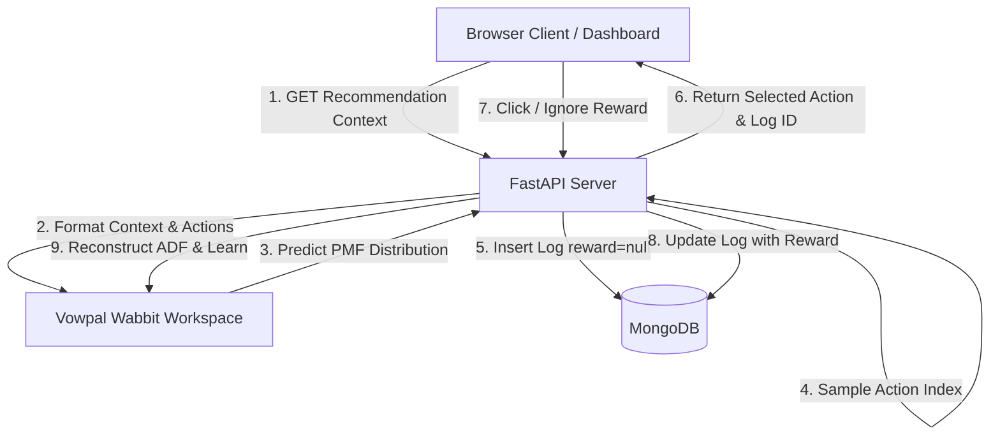

# Self-Healing Contextual Bandit Recommendation Loop

A local, self-optimizing contextual bandit recommendation engine with a real-time React dashboard. The backend manages a Vowpal Wabbit online learning loop and logs state to a local MongoDB database. The frontend visualizes the model's Probability Mass Function (PMF) and cumulative reward history dynamically.

---

## 🚀 The Core Paradigm: Contextual Bandits vs. Static ML

Most recommendation engines rely on static machine learning models trained in batches (e.g., collaborative filtering or offline classifiers). This project moves beyond static ML to a **dynamic, agentic reinforcement learning approach**:

1.  **Contextual Awareness:** It looks at the specific environment right now (Time: *Morning/Evening*, Device: *Mobile/Desktop*) before choosing what item to recommend.
2.  **Exploration vs. Exploitation:** The system solves the multi-armed bandit dilemma. It balances recommending what it already knows the user likes (exploitation) with trying out new items (exploration) using an epsilon-greedy strategy ($\epsilon = 0.1$).
3.  **Online Learning (Vowpal Wabbit):** Models do not go stale. Weights are updated incrementally in-memory after *every single interaction* (click/ignore), removing the need for periodic retraining.
4.  **Agentic Feedback Loop:** The system observes context $\rightarrow$ makes a decision based on probability $\rightarrow$ logs state $\rightarrow$ awaits user feedback $\rightarrow$ adjusts model weights autonomously.

---

## 🏗️ System Architecture



### Tech Stack
*   **Backend:** Python 3.10+, FastAPI, `vowpalwabbit`, `pymongo`, `uvicorn`.
*   **Frontend:** React (Vite), Tailwind CSS, Recharts (data visualization), Lucide React (icons).
*   **Database:** Local MongoDB (running on `localhost:27017`).

---

## ⚡ MLOps Breakthrough: Namespace Crossing (`-q UA`)

To make recommendations context-aware, the backend interacts the **`User`** context namespace and the **`Action`** namespace. 

Without namespace crossing, Vowpal Wabbit evaluates user context and actions independently, leading to global popularity bias (recommending the overall most popular item across all contexts). By adding the `-q UA` (quadratic) argument to the VW Workspace, the engine dynamically crosses user context and item features (e.g., `time=morning` $\times$ `action=Fashion_Trends_Video`).

### Simulation Convergence Proof
*   **WITHOUT Namespace Crossing:**
    *   `Morning / Mobile` $\rightarrow$ Recommends `Financial Digest` (92.5%) ❌ *(Incorrect)*
    *   `Evening / Desktop` $\rightarrow$ Recommends `Financial Digest` (92.5%) ❌
*   **WITH Namespace Crossing (`-q UA`):**
    *   `Morning / Mobile` $\rightarrow$ Recommends `Fashion Tips` (92.5%) ✅ *(Correct!)*
    *   `Evening / Desktop` $\rightarrow$ Recommends `Financial Digest` (92.5%) ✅ *(Correct!)*

---

## 📂 Project Structure

```
├── backend/
│   ├── main.py             # FastAPI App containing VW & MongoDB integrations
│   └── vw_formatter.py     # Utilities to compile dictionaries to VW ADF format
├── frontend/
│   ├── src/
│   │   ├── api.js          # Fetch wrapper connecting dashboard to FastAPI
│   │   ├── App.jsx         # Dashboard UI, charts, and simulation controllers
│   │   ├── index.css       # Tailwind directives & premium custom styles
│   │   └── main.jsx
│   ├── tailwind.config.js
│   └── package.json
├── mongodb_data/           # Isolated database files (git ignored)
└── bandit_performance_report.html # Visually premium validation report
```

---

## 🛠️ Installation & Setup

### Prerequisites
1.  **Python 3.10+** (tested on Python 3.13.7)
2.  **Node.js v18+ & npm**
3.  **MongoDB Server** (installed locally at `C:\Program Files\MongoDB\Server\8.3\bin\mongod.exe` or equivalent)

### Step 1: Start MongoDB
Create a data folder inside the project and start the MongoDB daemon pointing to it:
```powershell
mkdir mongodb_data
Start-Process -FilePath "C:\Program Files\MongoDB\Server\8.3\bin\mongod.exe" -ArgumentList "--dbpath mongodb_data --port 27017" -NoNewWindow
```

### Step 2: Install and Start Backend API
Open a terminal in the root directory:
```powershell
# 1. Create and activate virtual environment
python -m venv .venv
.venv\Scripts\activate

# 2. Install dependencies
pip install vowpalwabbit fastapi uvicorn pymongo httpx

# 3. Start backend API
uvicorn backend.main:app --reload --host 127.0.0.1 --port 8000
```
*The API docs will be available at `http://127.0.0.1:8000/docs`.*

### Step 3: Install and Start Frontend Client
Open a second terminal:
```powershell
# 1. Navigate to frontend folder and install npm packages
cd frontend
npm install

# 2. Launch Vite client
npm run dev
```
*Open your browser to the local URL (usually `http://127.0.0.1:5173`).*

---

## 📈 Real-Time Simulation & Verification

The frontend includes an **Auto-Simulation Loop** which simulates human users with the following programmed preferences:

| Time Context | Device Context | Programmed Preference (Cost = -1.0) | Other Actions CTR (Cost = 1.0) |
| :--- | :--- | :--- | :--- |
| **Morning** | **Mobile** | **Fashion Trends Video** (80% CTR) | 10% CTR |
| **Morning** | **Desktop** | **Tech News Article** (85% CTR) | 15% CTR |
| **Evening** | **Mobile** | **Gaming Live Stream** (90% CTR) | 10% CTR |
| **Evening** | **Desktop** | **Financial Market Digest** (80% CTR) | 20% CTR |

### To verify the learning loop:
1.  Verify the status indicators show **MongoDB: Connected** and **VW Model: Ready** (Green).
2.  Click **Reset Loop** in the top right to erase old logs and clear Vowpal Wabbit's in-memory weights.
3.  Click **Start Auto-Simulation**.
4.  Toggle between context options (e.g., `Morning/Mobile` vs `Evening/Desktop`). Watch the **Live Probability Distribution (PMF)** bar chart adjust as rewards are registered.
5.  Within ~100 iterations, the model will successfully exploit preferences, pushing the target action's probability to **92.5%** and minimizing the overall cost towards **-0.7** on the **Learning Curve**.

---

## 🗄️ Database Auditing

MongoDB documents in the `recommendation_logs` collection store the full interaction history:

```json
{
  "_id": "ObjectId",
  "context": { "time": "morning", "device": "mobile" },
  "action": "Fashion Trends Video",
  "action_index": 1,
  "pmf": [0.025, 0.925, 0.025, 0.025],
  "probability": 0.925,
  "reward": -1.0,
  "timestamp": "2026-07-13T15:45:00.000Z"
}
```


To audit logs directly from your terminal, run the query script:
```powershell
python C:\Users\shanm\.gemini\antigravity-ide\brain\b18c31a9-827d-4d54-92d4-4c328628cf62\scratch\query_db.py
```